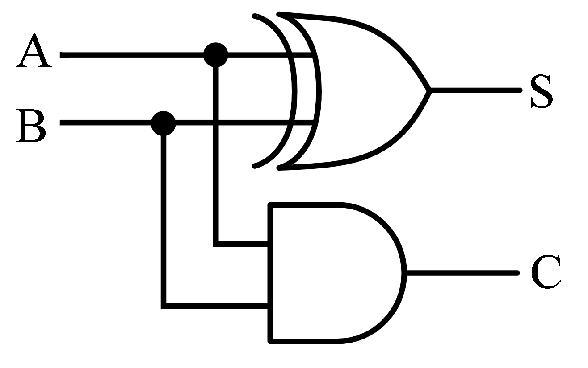
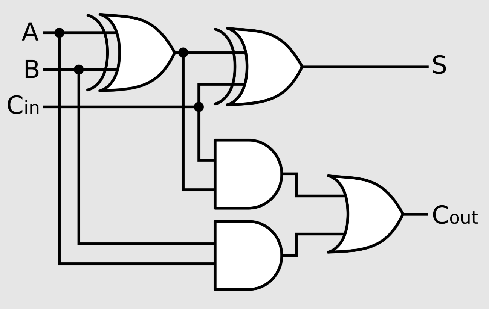

# virtual-alu

This project was created for learning how CPU works. It demonstrates how a processor performs, and how CPU does base arithmetic operarions(+, -, *, /). Built-in arithemic is faster, but the goal of my project is to show the essence and operating algorithms of Arithmetic Logic Unit.

## Skills & Concepts:
### Hardware:
*  **ALU;**
*  **Logic gates and schematic of CPU;**
*  **2-Bin system;**
*  **Ripple Carry Adder logic;**
### C++ features:
* **std::bitset;**
* **bitwise operations;**

## Adders
ALU methods are implemented in accordance with real hardware schematics shown below.

### Half adder

### Full adder

## Extra:
* **Language: C++20**
* **IDE: Visual Studio 2022**
